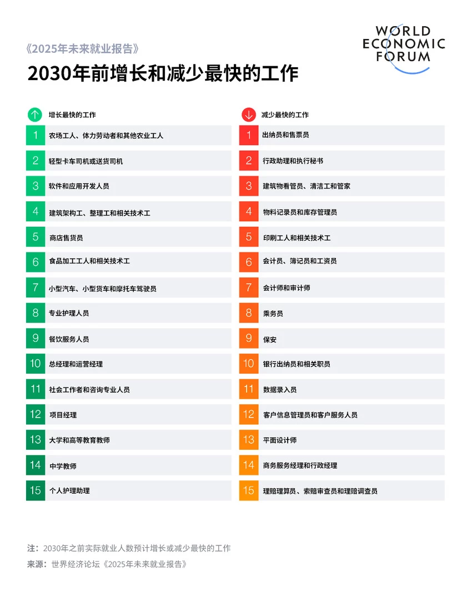
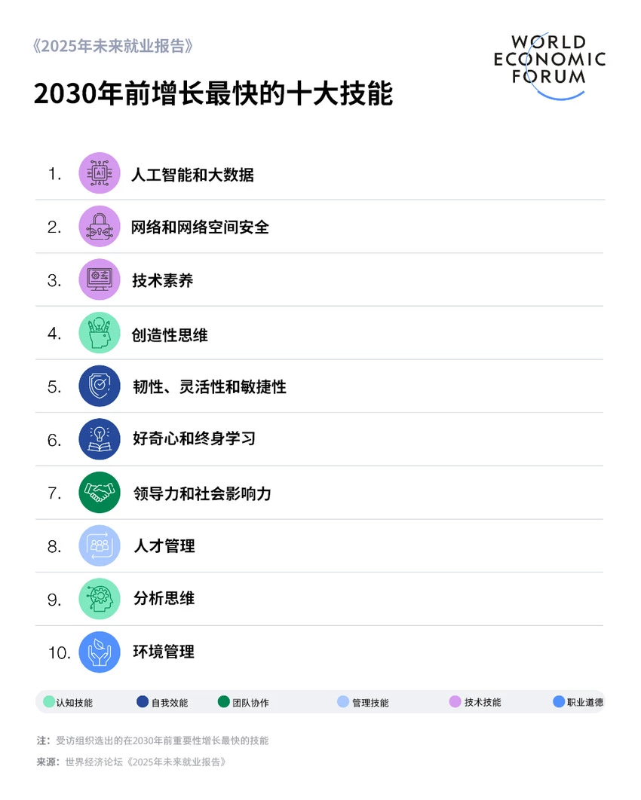
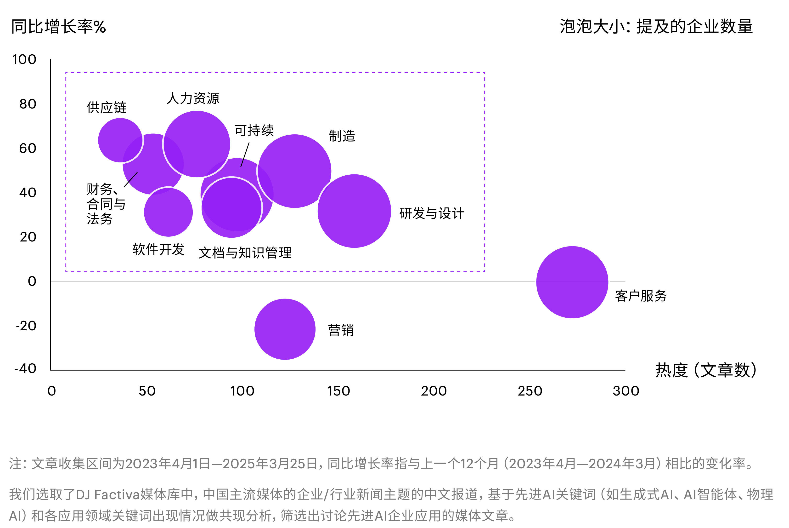

1. 专业导论: AI 与职业发展
1.1 专业导论: AI 与职业发展

### 各方观点
- temp

### 世界经济论坛 (WEF)
- 《2025 年未来就业报告》: 到 2030 年, 有 9200 万个岗位消失, 净增加 7800 万个就业机会
- 22% 的就业机会将面临变革
- 增长最快的职业主要集中在技术领域
- 企业转型的首要障碍是技能差距
- 创造性思维、韧性、灵活性和敏捷性等人类技能至关重要
- 77% 的雇主计划升级员工技能

#### 2030 年前增长和减少最快的工作

#### 2030 年前增长最快的十大技能

### 德勤 (Deloitte)
- 基础制造和技术岗位 (如焊接技工) 出现人才短缺
- 最需求的 10 大岗位中, 有 9 项仅需高中学历
- 人工智能对入门级岗位的冲击加剧
- 企业应帮助员工重塑技能, 培训应着眼于 "人机协同" 模式, 让人类持续学习创造力、数据分析等技能

### 波士顿咨询 (BCG)
- 《2025 年 AI 职场调查》发现存在 "AI 硅天花板": 高层和经理的使用率超过 75%, 但只有约 51% 的一线员工经常使用 AI 工具
- 领导支持可显著提高员工采纳率; 有支持时, 对 GenAI 持正面看法的员工比例从 15% 升至 55%
- 在全面推进 AI 改造工作流程的公司中, 46% 的员工担忧未来十年失业
- 调查建议企业加强 AI 培训和人机协作, 以缓解员工的失业焦虑

### 普华永道 (PwC)
- 《2025 年全球 AI 工作晴雨表》显示, AI 推动了生产力增长实现四倍提升
- 拥有 AI 技能的员工平均薪资溢价达 56%, 是去年的两倍
- 从 2019 到 2024 年, 最易被 AI 替代职业的岗位数量仍增长了 38%
- 需要 AI 技能的岗位增长速度高于所有工作岗位
- 受 AI 影响的行业每位员工的营收增长 (27%) 是影响最小行业 (9%) 的 3 倍
- AI 密集型职业的岗位技能需求变化速度比其他岗位高出约 66%

### IEEE (Spectrum 和 IEEE-USA)
- 使用 AI 最多的职业中, 年轻员工的就业大幅下降, 美国软件工程等初级岗位受冲击最大
- AI 工具正取代许多传统由初级员工完成的任务, 而经验丰富的老员工更难被取代
- 尽管初级岗位受冲击, 但全球 AI 岗位需求在疫情后低谷后全面回升
- Python 仍是 AI 岗位中需求最强烈的技能
- IEEE-USA 强调未来工作要求 "混合型" 人才, 即创造力、情商等软技能与技术专业技能同等重要

### 斯坦福大学 (Stanford HAI)
- 《2025 年 AI 指数报告》显示 AI 应用回暖
- 全球私营 AI 投资达 2523 亿美元, 创历史新高
- GenAI 的企业使用率从 33% 飙升至 71%
- AI 提升了生产力, 并在多数情况下有助于缩小劳动力技能差距
- 招聘市场要求 AI 技能的岗位持续增长
- 报告建议高等院校和学生关注 AI 技术与其他学科的融合, 学习复合技能

### 领英 (LinkedIn)
- 《2025 年工作场所学习报告》指出, 重视职业发展的企业在盈利能力、吸引和留住人才方面表现更好
- 在这些 "职业发展冠军企业" 中, 51% 认为其组织有利于 GenAI 转型

### 埃森哲 (Accenture)
- 《2025 年技术展望》显示, 75% 的知识工作者使用 GenAI 提升工作效率
- 超一半使用 AI 的员工不愿承认使用 AI 完成重要任务, 担心雇主会认为他们可以被替代
- 《2025 年中国企业数字化转型指数》显示, 仅 47% 的中国企业为员工设计了 AI 相关学习路径
- 企业对 AI 的认知与行动仍集中在 "工具应用" 层面, 而非 "组织能力"

#### 企业关注的 AI 应用领域

### 麦肯锡 (McKinsey)
- 全球 AI 劳动力洞察显示, AI 已直接影响全球 47% 的工作场景

### 相同或相近的观点
- temp

### AI 技能需求激增且带来高溢价
- **PwC**: AI 技能岗位薪资溢价达 56%
- **WEF**: AI / 大数据专家是增长最快的职业之一
- **Stanford 和 IEEE**: AI 技能岗位需求持续增长, 特别是 GenAI 的需求增长了近 4 倍

### 技能重塑 (Reskilling) 是核心挑战
- **WEF**: 近 40% 的工作技能将改变, 技能差距是企业转型的首要障碍
- **Deloitte**: 企业必须帮助员工重塑技能以适应 "人机协同"
- **PwC**: AI 密集型职业的技能需求变化速度比其他岗位快 66%

### AI 提升生产力
- **PwC**: AI 推动生产力增长实现四倍提升
- **Stanford**: AI 提升了生产力
- **Accenture**: 75% 的知识工作者使用 GenAI 提升效率

### 需要 "复合型" 或 "混合型" 人才
- **WEF**: 技术技能 (AI、大数据) 和人类技能 (创造力、韧性) 同等重要
- **IEEE-USA**: 未来需要 "混合型" 人才, 即软技能与技术技能的结合
- **Stanford**: 建议学生学习 AI 与数据分析等复合技能

### AI 岗位需求持续增长
- **PwC**: 需要 AI 技能的岗位增长速度快于平均水平
- **Stanford**: 招聘市场要求 AI 技能的岗位持续增长
- **IEEE**: 全球 AI 岗位需求在疫情后全面回升

### 不同或有差异的观点
- temp

### 对就业总量的宏观影响
- **净增长**: WEF 预测到 2030 年将净增加 7800 万个就业机会
- **未减少**: PwC 的立场是 AI 并未导致大规模岗位减少, 并指出从 2019 到 2024 年, 即使是 "最易被 AI 替代" 的职业, 岗位数量仍在增长

### 对入门级岗位的影响
- **负面冲击**: IEEE 和 Deloitte 指出, AI 正在冲击入门级岗位, 导致年轻员工和应届毕业生的就业大幅下降
- **自动化岗位增长**: PwC 发现 "最易实现自动化" 的岗位就业人数仍在增长

### 员工对 AI 的态度与焦虑
- **高度焦虑和不信任**: Accenture 发现, 超过一半使用 AI 的员工不愿承认, 担心被替代, AI 动摇了信任关系
- **态度可被引导**: BCG 同时指出, 员工的态度并非不可改变, 强有力的 "领导支持" 可以将对 GenAI 持正面看法的员工比例从 15% 提升到 55%

### AI 在企业内部的应用差距
- **层级差距**: BCG 发现 AI 使用率在高层和经理中 (> 75%) 远高于一线员工 (~ 51%)
- **认知差距**: Accenture 发现, 企业将 AI 视为效率工具而非组织能力, 缺乏系统的流程和人才变革

### 宏观趋势与应对
- tmep

### 宏观趋势: 岗位在消失吗
- **世界经济论坛 (WEF)** 预测:
- 到 2030 年, 创造 1.7 亿个新岗位
- 9200 万个岗位消失
- 净增加 7800 万个岗位
- **IEEE** 预测:
- 自动化淘汰 8500 万个岗位
- 创造 9700 万个新岗位 (AI 开发, 数据分析等)
- **普华永道 (PwC)** 观点:
- AI 并未导致大规模岗位减少
- 2019-2024 年, 最易被 AI 替代的岗位数量仍增长 38%

### AI 的机遇: 薪资与生产力
- **普华永道 (PwC)** 发现:
- 拥有 AI 技能的员工, 平均薪资溢价 56%
- 薪资溢价是前一年的两倍
- 受 AI 影响行业的营收增长, 是影响最小行业的 3 倍
- **世界经济论坛 (WEF)** 发现:
- 增长最快的职业是大数据专家, AI/机器学习专家, 金融科技工程师

### AI 的挑战: 谁受到冲击
- **德勤 (Deloitte)** 观点:
- AI 对入门级岗位的冲击加剧
- 计算机科学等专业应届生更难找到工作
- **IEEE** 报告:
- 使用 AI 最多的职业中, 年轻员工的就业大幅下降
- 美国软件工程等初级岗位受到冲击最大
- AI 正逐步取代初级员工的传统任务
- **BCG** 调研:
- 46% 的员工担忧未来十年失业

### 职场的断层: 技能差距
- **世界经济论坛 (WEF)** 观点:
- 约 39% 的工作所需关键技能将发生改变
- **普华永道 (PwC)** 观点:
- AI 密集型职业的技能需求变化速度, 比其他岗位高 66%
- **德勤 (Deloitte)** 观点:
- 出现 "岗位需求不匹配"
- 最需求的 10 大岗位中, 9 项仅需高中学历
- 就业热点向技能型蓝领倾斜

### 职场的现实: AI 硅天花板
- **波士顿咨询 (BCG)** 调研发现:
- 存在 "AI 硅天花板"
- 高层和经理使用率: 超过 75%
- 一线员工使用率: 仅约 51%
- 领导支持是关键:
- 强力领导支持时, 对 GenAI 持正面看法的员工比例可从 15% 升至 55%

### 应对冲击: 所需技能
- **技术硬技能 (Stanford HAI)**:
- Python (需求增长 527%)
- 数据分析
- 云服务
- **关键软技能 (IEEE / Deloitte)**:
- 需要 "混合型" 人才
- 创造力
- 情商与批判性思维
- 沟通与解决问题能力
- "人机协同" (Human-AI Collaboration)

### 三个建议
- temp

### 择业建议
- 不要对抗 AI, 要驾驭 AI
- 避开重复性初级岗位
- 选择人机协同的岗位
- 成为混合型人才

### 自学建议
- 立即行动, 提升 AI 素养
- AI 不只是工具, 更是队友
- 学习硬技能 Python
- 刻意训练创造力、批判性思维、共情与沟通能力

### 职业发展建议
- 不要焦虑被替代, 要思考如何利用
- 克服 AI 硅天花板
- 终身学习是唯一出路
- 管理焦虑, 保持乐观

### 报告下载
- [World Economic Forum](./resourse/WEF_Future_of_Jobs_Report_2025.pdf)
- [Deloitte](./resourse/DI_Tech-trends-2025.pdf)
- [Boston Consulting Group](./resourse/ai-at-work-2025-slideshow-june-2025-edit-02.pdf)
- [PwC](./resourse/pwc-report-2025.pdf)
- [Stanford University HAI](./resourse/hai_ai_index_report_2025.pdf)
- [LinkedIn](./resourse/LinkedIn-Workplace-Learning-Report-2025.pdf)
- [Accenture](./resourse/Accenture-TechVision-2025-Full-Report-CN.pdf)
