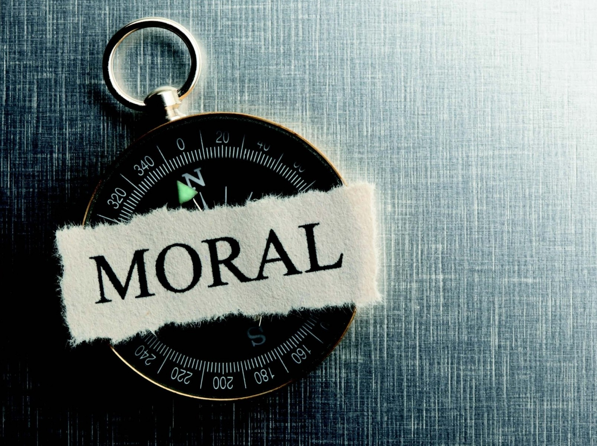
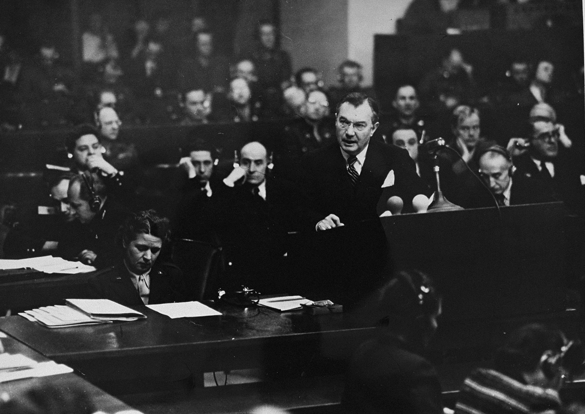
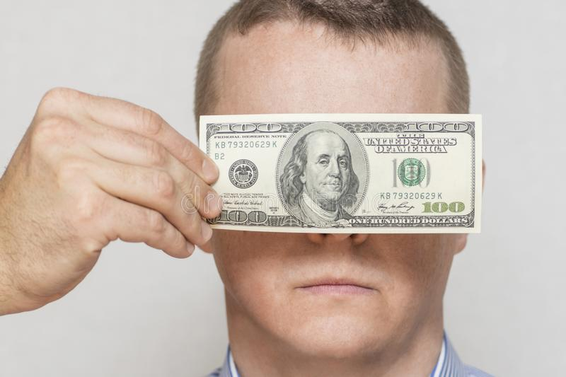

### 自动化偏见 Automation Bias

倾向于过度依赖自动化系统，这可能导致错误的自动化信息覆盖正确的决策 [18]。

### 可得性捷思 Availability Heuristic

容易想到的事，其发生概率会受高估，然而一件事是否容易想到还受发生多久、激起[情绪](img/x-Devonthink-Item://02a3cd20-C684-4493-929e-dea2acda8b04.jpeg)的程度等因素影响，无法反映实际的发生概率 [19]。

### 可获性层叠 Availability Cascade

一件事越常被公开谈论，就越加相信其真确性（类似 “三人成虎”）[20]。

### 逆火效应 Backfire Effect

遇上与自身信念抵触的观点或证据时，除非它们足以完全摧毁原信念，否则会忽略或反驳它们，原信念反而更加强化 [21]。

### 从众效应 Bandwagon Effect

倾向做很多人做的事或相信很多人相信的事（社会心理学中人受社会所影响）[22]。

### 信念偏差 Belief Bias

由于相信结论，而认为推理出该结论的过程是有[道理](img/x-Devonthink-Item://6568070c-C5a0-41eb-87ce-3c7f1e8275d6.jpeg)、合逻辑的 [23]。

### 偏见盲点 Bias Blind Spot

认为自己比其他人更能辨识认知偏差，也较不易受影响 [24]。

### 啦啦队效应 Cheerleader Effect

处在优秀的团体会比单独看起来更优秀 [25]。

### 支持选择偏差 Choice-supportive Bias

对自己先前选择的评价会比实际上更好 [26]。

### 集群错觉 Clustering Illusion

过度期待从小样本或小型测试中发现的规律，然而这些小样本或小型测试是从大样本随机抽取，大样本往往并无这种规律（统计学取样偏差）[14]。

### 舒适区效应 Comfort Zone Effect

对于过去常用的方案（舒适圈），高估效益或成功机会；对于过去少用的方案，低估效益或成功机会。[来源请求]

### 确认偏误 Confirmation Bias

关注、寻找、诠释、记忆资讯的方向多半是能确认自己成见的方向（舒适圈）[27]。

### 相合性偏差 Congruence Bias

直接检验假设，却没想到要检验其他可能的假设 [14]。

### 退缩偏差 Regressive Bias

倾向保守中庸，低估高价值高或然率的事而高估低价值低或然率的事 [28][29][30]。

### 保守倾向 (贝叶斯) Conservatism Bayesian

新证据出现时，对既有信念的修正幅度不足 [28][31][32]。

### 对比效应 Contrast Effect

感受特质的程度主要是受与其他相关事物的对比程度影响，而非受其实际程度影响 [33]。

### 知识的诅咒 Curse Of Knowledge

懂得多的人非常难以懂得少的人的角度思考问题 [34]。

### 诱饵效应 Decoy Effect

评估对 A 与 B 事物的偏好时，如有个 C 与 B 相近却略逊一筹，就会觉得 B 事物更好。（即以 C 为诱饵）

### 默认效应 Default Effect

当在几个选项中进行选择时，倾向于选择默认选项。

### 既视感 DéjàVu

对某些事物有强烈的熟悉感，似乎曾经接触过，且能预先想到接下来会发生什么事。

### 面额效应 Denomination Effect

即使金钱总额相同，带小面额（如多量硬币）比带着大面额（如少量纸钞）更容易消费掉 [35]。

### 差异偏差 Distinction Bias

相较于分开比较，两件事物放在一起比较，差异会显得更大 [36]。

### 过程时间忽视 Duration Neglect

评价不愉快及痛苦的经验时，其持续时间影响不大。（参见峰终法则）

### 移情隔阂 Empathy Gap

情感冷淡时，低估他人情感的强烈程度；情感强烈时，高估他人情感的强烈程度。

### 禀赋效应 Endowment Effect

拥有或即将拥有某物品或资产时，对其价值的评估会比没有时高出许多，因而不愿失去或放弃它 [37]。

### 本质主义 Essentialism

认为人与事物有一些不可或缺的本质，并据此为它们分类，其他的分类方式是错误的 [38]。

### 极端预期 Exaggerated Expectation

实际上的情况通常不如我们所预期的极端 [28][39]。

### 功能固着 Functional Fixedness

受物品的一般用途局限，无法想到用特别的方式利用物品。（无法跳脱框架）

### 聚焦效应 Focusing Effect

过分关注事情的某些明显面向、忽略不明显面向，导致不恰当的预期[40]。

### 巴纳姆效应 Barnum Effect

人们会把他们认为是为自己量身定做的人格描述评价为高度准确，而这些描述往往十分模糊及普遍，能放诸四海皆准适用于很多人。

### 框架效应 Framing Effect

同一资讯以不同方式呈现方式会带来不同想法，例如 “有十分之九的存活率” 和“有十分之一的死亡率”。

### 频率错觉 Frequency Illusion

因最近注意到一件原先没注意到的事，就觉得这件事到处都在发生。（参见近因错觉（英语：Recency Illusion）及选择偏差（英语：Selection Bias））[41]

### 难易效应 Hard-Easy Effect

高估自认困难之事的难度，低估自认简单之事的难度 [28][42][43][44]。

### 后见之明偏误 Hindsight Bias

又称 “我早就知道了”、“马后炮”、“事后诸葛”。在事情发生或发展后，以为自己事前就能预测其发生与发展 [45]。

### 敌对媒体效应 Hostile Media Effect

对于立场与自己不同的媒体，总认为它们有偏见、不客观。

### 当下偏差 Current Moment Bias

看重当下利益、低估长远利益。（短视近利）得到利益前的延迟时间越长，对利益的价值评估便打越多折扣，两者关系近似于双曲线[46]。

### 可辨识受害者效应 Identifiable Victim Effect

对于少数而容易辨识的受害者或潜在受害者反应过大，而对多数而不易辨识的受害者或潜在受害者反应过小 [47]。

### 宜家效应 Ikea Effect

对于需要自行组装的东西给予不成比例的高评价，而不管其实际品质。此称呼出自于经常贩售组装家具的宜家。

### 控制错觉 Illusion Of Control

高估自己对外在事件的影响力，认为事情是受自己控制或影响，但实际上可能与自己毫无关系 [48]。

### 效度错觉 Illusion Of Validity

高估面谈或直接观察的效度且能用于提供预测，即使证据指出它们影响甚微。

### 错觉相关 Illusory Correlation

认为两件事应该有关系时，便会在检视经验与数据时觉得它们经常一起发生，即使它们一起发生纯粹是随机现象 [49][50]。

### 影响力偏差 Impact Bias

高估感觉的强度或持续时间 [51]。

### 资讯偏差 Information Bias

倾向寻求更多资讯以做出决策，即使寻求的资讯对决策没有帮助 [52]。

### 沉没成本谬误 Sunk Cost Fallacy

由于先前已在某事上投资很多，即使新证据显示那是不好的选择，仍倾向于加重投资。

### 妄下结论 Jumping To Conclusions

根据少许的资讯即做出判断与决策。如诛心、预言、贴标签等等。

### 公正世界理论 Just-world Hypothesis

相信世界是公平的（上帝是公平的），发生在身上的都是应得的，把难以解释的不公平归责于受害者的报应或是源自于受害者内在本质的结果。（基本归因谬误）

### 少即是好效应 Less-is-better Effect

分开评估时倾向选择较小组的东西，一起评估时倾向选择较大组的东西。

### 损失趋避 Loss Aversion

认为放弃一件事物的效益损失大于得到一件事物的效益所得。（参见沉没成本与原赋效应）[53]

### 多看效应 Mere Exposure Effect

对熟悉的人与事产生过多的好感 [54]。

### 货币错觉 Money Illusion

专注于货币名目上（表面上）的价值，而非其实质购买力[55]。

### 道德许可证效应 Moral Credential Effect

由于得到了某些高道德的评价或认证，而认为自己做得够好，反而在其他面向做了相反的事。例如投身环保活动并受到表扬的人，往往忽略了许多自己的不环保行为。

### 正面效应 Positivity Effect

评价喜欢的人的行为时，把他们做好事归因于内在本质，而把他们做坏事归因于环境因素。评价不喜欢的人的行为时，把他们做好事归因于环境因素，而把他们做坏事归因于内在本质。（基本归因谬误）

### 负面偏差 Negativity Bias

容易回想消极的回忆而不易回想积极的 [56]。

### 忽略可能性 Neglect Of Probability

对于不确定的事，无法准确评估其发生几率，不是完全无视，便是过分高估 [57]。

### 正常化偏差 Normalcy Bias

根据过去的经验了解情况，低估大灾难的可能性及其影响力，因而平时没有预做准备，或在灾难发生时轻忽严重性、缺乏应变。

### 不作为偏差 Omission Bias

认为主动作为导致伤害比被动不作为导致伤害更糟糕、更不道德，即使后者伤害与前者相当或比后者更多 [58]。

### 乐观偏误 Optimism Bias

低估负面事件发生在自己身上的可能性，相信自己比其他人更不容易遇到不好的事。（参见一厢情愿）[59][60]

### 鸵鸟效应 Ostrich Effect

忽视明显的（负面）情况。

### 结果偏差 Outcome Bias

评价决策好坏时，根据其最终结果，而不是根据下决策当时的决策品质。

### 过度自信效应 Overconfidence Effect

过度相信自己回答、决策、判断的正确性[28][61][62][63]。

### 空想性错视 Pareidolia

从模糊、随机的影像中看出有意义的东西，例如从云朵中看出脸孔。有时也延伸指听觉，如录音带倒播时听出特别的讯息。

### 悲观偏误 Pessimism Bias

高估负面事件发生在自己身上的可能性，相信自己比其他人更容易遇到不好的事。患有抑郁症的人尤其明显。（参见悲观主义）

### 规划谬误 Planning Fallacy

低估完成一件事需要的时间 [51]。

### 正面结果偏差 Positive Outcome Bias

认为好事比坏事更可能发生。

### 购后合理化 Post-Purchase Rationalization

购买后把之前的购买决定合理化，即使买下的产品太过昂贵或发现瑕疵。

### 支持创新偏差 Pro-Innovation Bias

对新技术过度乐观、高估其实用性，忽视其限制及弱点。

### 假确定性效应 Pseudocertainty Effect

预期结果是正面就选择避开风险，预期结果是负面就选择寻求风险 [64]。

### 对抗心理 Reactance

他人要求做或不做某事时，有做相反事的冲动，尤其这要求对自由、[自主](img/x-Devonthink-Item://8525d56f-380e-4e67-A689-c682d7207384.jpeg)造成威胁时。（参见逆反心理 ）。

### 反应式贬低 Reactive Devaluation

贬低敌对者的要求或方案，或当敌对者在某事让步时，觉得此时不再有吸引力。

### 近期偏好 Recency Illusion

### 自制偏差 Restraint Bias

高估自己对诱惑的自制力。

### 韵律当理由效应 Rhyme As Reason Effect

认为有韵律的语句比较有[道理](img/x-Devonthink-Item://6568070c-C5a0-41eb-87ce-3c7f1e8275d6.jpeg)。（押韵）

### 风险代偿 Risk Compensation

感觉情况安全时，会倾向冒更大的风险。

### 选择性注意 Selective Attention

由于对人或事有特定期待，因而倾向于注意符合期待的事件，忽略或忘却不符合期待的事件。

### 塞麦尔维斯反射 Semmelweis Reflex

条件反射般地否定、拒绝新证据或新知识，因其抵触现有的常规、信仰或价值观（认知闭合）[32]。

### 社会比较偏差 Social Comparison Bias

抗拒雇用、提拔与自己有相似专长的人 [65]。

### 安于现状偏差 Status Quo Bias

倾向于维持现状。（参见损失趋避、原赋效应、系统正当化）[66][67]

### 刻板印象 Stereotyping

根据事物的所属类别或群体判断其特质，而忽略其独特性。

### 斯德哥尔摩症候群 Stockholm Syndrome

被害者认同加害者的某些观点和想法，并觉得自己不再受到威胁。

### 分开加总效应 Subadditivity Effect

评估可能性时，对整体直接评估低于对各部分分别评估再加总 [68]。

### 主观验证 Subjective Validation

相信某事是对的，就感觉它是对的。也会把巧合的事当做有关联。

### 幸存者偏差 Survivorship Bias

专注于从某个过程中存活下来的人或事寻找弱点意欲补强，却忽略了最大的弱点更可能在未存活的人或事之中。

### 省时偏差 Time-Saving Bias

低速行进时，低估可节省的时间或高估会损失的时间；高速行进时，高估可节省的时间或低估会损失的时间。

### 单位偏误 Unit Bias

认为计量单位反映合理程度。例如认为一瓶、一碗、一盘食物是最合理的食用量 [69]。

### 熟悉路线效应 Well Travelled Road Effect

低估采用熟悉路线的时间，高估采用陌生路线的时间。

### 只看整体效应 Whole Only Effect

选项为整套方案时，忽略个别部分有协商的可能。

### 零风险偏误 Zero-Risk Bias

偏好把小风险降为零（例如 1% → 0%），胜过把大风险降低更多（例如 5% → 2%）。

### 零和捷思 Zero-Sum Heuristic

直觉判定一个情况是零和的，但实情未必如此。零和一词源于博弈论，是指成功与失败期望值的总和为零 [70][71]。

### 唤醒的错误归因 Misattribution Of Arousal

当产生莫名的生理反应或认知矛盾时，人们可能会以不相干的理由来合理化之。又称为吊桥效应。

### 行为者-观察者偏差 Actor-Observer Bias

解释他人行为归因于内在个性，解释自己行为则归因于环境影响（​​参见基本归因错误）。

### 防卫性归因 Defensive Attribution Hypothesis

把自己的成功归结于内在因素，如自己的能力、品质、努力等；把自己的失败归结于外在因素，如运气坏、环境恶劣、任务困难等。

### 达克效应 Dunning-Kruger Effect

能力过差的人由于无法分辨能力好与能力差的不同，因而认为大家都一样 [72]。

### 自我中心偏差 Egocentric Bias

过于依赖自己的观点和对自己的评价过高而不合实际情况

### 外在激励偏差 Extrinsic Incentives Bias

认为他人需要外在激励才会做好，而自己可以靠内在激励做好。基本归因错误的反例。

### 错误共识效应 False Consensus Effect

高估别人对自己的认同程度，认为所有人以同一方式思考 [73]。

### 基本归因错误 Fundamental Attribution Error

解释他人行为时，归因于内在特质（一定是他有这样的人格，才做出这样的行为），而非外在情境（也许是情势所迫，或这个场所有特殊的潜规则）[74]。

### 群体归因错误 Group Attribution Error

把个体的特质当作其所属群体的特质，或把个体的行为当做其所属群体的偏好。（白马非马：局部不可以代表整体。）

### 团体迷思 Groupthink

又称集体错觉。团体在决策过程中，由于成员倾向让自己的观点与团体一致，因而令整个团体缺乏不同的思考角度，不能进行客观分析。

### 晕轮效应 Halo Effect

评价他人时，以整体观感评断特定的能力、素质。（参见刻板印象）[75]

### 认知不对称错觉 Illusion Of Asymmetric Insight

认为自己比其他人懂得更多 [76]。

### 外部机构错觉 Illusion Of External Agency

由于对外部机构有主观喜好，而认为其资讯是有影响力的、有洞察力的、仁慈的。

### 透明度错觉 Illusion Of Transparency

认为自己很容易被他人看透，或认为自己很容易看透他人。

### 优于常人效应 Better-Than-Average Effect

高估自己的优点、低估自己的缺点 [77]。是差于常人效应（英语：Worse-Than-Average Effect）的反例。

### 群内偏见 Ingroup Bias

认为对方属于自己团体，便给予较好的待遇。

### 道德运气 Moral Luck

评价他人行为的道德时，根据结果而非根据行为时的情境。

### 素朴犬儒主义 Naïve Cynicism

认为其他人比自己更自我中心。

### 素朴实在论 Naïve Realism

相信自己所见所闻即是真相、是客观且不带偏见的，认为这是显而易见的事实，理性人一定会同意自己，不同意的人一定是资讯不足、懒惰、不理性或有偏见。（参见哲学实在论）

### 外团体同质性偏见 Outgroup Homogeneity Bias

认为自己群体的成员比较多样化，而外部群体的成员是相当单一的 [78]。

### 投射偏差 Projection Bias

不自觉地以为他人（或未来的自己）和（现在的）自己有相似的情感、思想与价值观[79]。

### 自利偏差 Self-Serving Bias

将成功归因于自己，而将失败归因于环境。（参见基本归因错误）[80]

### 共有资讯偏差 Shared Information Bias

团队讨论倾向花较多时间与精力讨论所有成员都知道的事（即共有资讯），而花较少时间讨论较少成员知道的事 [81]。

### 系统正当化 System Justification

人们倾向于喜好与捍卫现有的社会、经济、政治安排，贬低其他方案，即使这样会犠牲个人或群体利益。（参见安于现状偏差）

### 性格归属偏差 Trait Ascription Bias

认为自己的个性、行为、[情绪](img/x-Devonthink-Item://02a3cd20-C684-4493-929e-dea2acda8b04.jpeg)是多变的，而他人是一成不变且容易预测的。（参见外团体同质性偏见）

### 终极归因错误 Ultimate Attribution Error

把问题归因于整个群体，而非群体中的个体。

### 差于常人效应 Worse-Than-Average Effect

对于高难度的事，认为自己比一般人差。是优于常人效应的反例 [82]。

### 怪异效应 Bizarreness Effect

怪异的事比寻常的事更容易记住。

### 改变偏差 Change Bias

参与一件事的改变后，不易回忆过去的情况 [83]。

### 童年失忆症 Childhood Amnesia

难以回忆四岁以前的事。

### 一致性偏差 Consistency Bias

记忆中他人过去的态度与行为会变得像目前的态度与行为[84]。

### 情境效应 Context Effect

某情境中的记忆在其他情境下较不易回想。

### 跨种族效应 Cross-Race Effect

难以分辨其他种族的人。

### 潜抑记忆 Cryptomnesia

接触后记得某些影像或语句，却不记得是看来听来的，甚至会误以为是自己原创，造成剽窃的争议 [83]。

回忆中的自己会美化，例如记忆中自己的考试成绩比实际更好。

### 情感衰退偏差 Fading Affect Bias

负面、不愉快的记忆比正面、愉快的记忆更快淡忘 [85]。

### 虚假记忆 False Memory

产生虚构的事填补记忆空白，即使没有欺骗意图。例如伪造某人的幼年照片给他看，他往往能说出以前做那些事的过程与回忆，但实际上他根本没做过。常见于记忆障碍的患者。

### 自我生产效应 Self-Generation Effect

自己生产的资讯记得比较清楚，他人生产的则容易淡忘。

### 谷歌效应 Google Effect

容易从网络上搜寻到的资讯比较容易遗忘。本词源自于著名的网络搜索引擎谷歌。

### 幽默效应 Humor Effect

幽默的事比不幽默的事更容易记住，可能的解释是幽默的事有较长的认知处理时间，或造成较多的情绪激发（处理难度效应（英语：Processing Difficulty Effect））。

### 真相错觉效应 Illusion Of Truth Effect

人们倾向认为听过的是真的（即使没意识到听过），而不管该陈述实际上是否有效。换言之，人容易相信熟悉的话胜过陌生的。

### 延迟效应 Lag Effect

比起短延迟时间的多次重复接触，长延迟时间的少次接触有较好的记忆与[学习](img/x-Devonthink-Item://48bc356e-7ccd-47da-8e36-29a58a0dc6e6.jpeg)效果。（亦见间隔效应）[86]

### 钝化与锐化 Leveling And Sharpening

记忆细节在每次回忆中扭曲的现象，特别重要的事会锐化或得到选取而忆起，事件的细节及详情则会钝化或遗失。时间过得越久或回忆次数越多，这种偏差就越加强 [87]。

### 处理深度效应 Levels-Of-Processing Effect

用不同方式 “编码” 的资讯，容易记忆的程度也不相同。例如视觉、听觉、触觉、嗅觉 [88]。

### 列表长度效应 List-Length Effect

列表中有越多东西，能记住的比例就越少，但能记住的项目总数会增加 [89]。

### 错误讯息效应 Misinformation Effect

记忆会受到事后资讯干扰，而变得不准确 [90]。错误讯息效应是逆向干扰 (img/retroactive-interference.jpeg) 的主要例子。

### 模态效应 Modality Effect

对于来自口语的讯息，最后听到的东西印象会较深刻；对于来自文字的讯息则不明显。

### 心境相合性记忆偏差 Mood-Congruent Memory Bias

与当下心境相合的资讯会比较容易回想。

### 轮流发言效应 Next-In-Line Effect

轮流发言时，后发言的人不易记住之前的人说过的话 [91]。

### 部分项目提示效应 Part-Set Cueing Effect

记忆的东西为一整组时，提示部分项目会使回想后续项目更困难 [92]。

### 峰终法则 Peak-End Rule

人们对一件事的体验通常是由最高峰的感觉与结尾的感觉决定，而不是由总体决定。

### 创伤的持续性 Persistence Of Traumatic Event

经历创伤事件后，往往会不断反复回忆。（参见创伤后压力症候群）

### 图片优势效应 Picture Superiority Effect

以图片传达概念较以文字传达概念容易学习与回忆[93][94][95][96][97][98]。

### 序位效应 Serial Position Effect

序列末尾的东西最容易回忆，其次是序列开头的，序列中间的讯息最不易记住 [99]。

### 处理难度效应 Processing Difficulty Effect

处理难度高的资讯，由于花较多时间阅读与思考，因而较易记住 [100]。

### 怀旧凸隆 Reminiscence Bump

回忆人生事件时，青春期和成年早期的事特别容易想到 [101]。

### 玫瑰色回忆 Rosy Retrospection

美化过去的回忆，往往比实际情况更好。

### 自身相关效应 Self-Relevance Effect

与自身相关的讯息较易回想，与他人相关的较不易。

### 来源混淆 Source Confusion

把偶发事件的记忆和其他资讯混淆，造成扭曲的记忆 [102]。

### 间隔效应 Spacing Effect

比起无间隔的重复接触，有间隔的重复接触有较好的记忆与[学习](img/x-Devonthink-Item://48bc356e-7ccd-47da-8e36-29a58a0dc6e6.jpeg)效果。（亦见延迟效应）[86]

### 镁光灯效应 Spotlight Effect

高估自身言行举止受他人关注的程度。

### 后缀效应 Suffix Effect

在资讯尾端加上不须记忆的项目，会使前面须记忆的项目变得特别不易记住。这是近时效应的一种应用 [103][104]。

### 可暗示性 Suggestibility

回想事情时，如旁人暗示了某些想法，想到的内容会受扭曲。

### 伸缩效应 Telescoping Effect

认为近期的事比实际久远些，久远的事比实际近期些。

### 考试效应 Testing Effect

反复书写比反复阅读更容易记住资讯 [105]。

### 舌尖现象 Tip Of The Tongue Phenomenon

能想起一件事的一部分或相关的东西，却难以想起全部。导致在向他人叙述时，说到一半突然卡住 [83]。

### 逐字效应 Verbatim Effect

话语中的大意比完整字句（逐字）更容易记住 [106]。

### 雷斯多夫效应 Von Restorff Effect

醒目的事或特别强调的事比其他的事更容易记住 [107]。

### 蔡格尼克效应 Zeigarnik Effect

比起己完成的事，未完成或中断的事情会记得更清楚。

### 基本比率谬误 Base Rate Neglect

只关注针对性的资讯，忽略一般性的资讯（基本比率），导致不恰当的认知。例如因为酒驾较容易肇事，就认为肇事者多半是酒驾，然而由于酒驾者占所有驾驶者的比率甚小，肇事者之中酒驾者的比例不会那么高 [108]。

### 合取谬误 Conjunction Fallacy

认为较特殊性的情况比较一般性的情况更可能发生。例如对某人的描述很像女性主义者会做的事时，认为某人是替妇女辩护的律师的可能性比某人是律师的可能性更高 [109]。

### 赌徒谬误 Gambler'S Fallacy

认为某事多次发生则未来发生的几率会较小，或多次未发生则未来发生的几率会较大。

### 逆赌徒谬误 Inverse Gambler'S Fallacy

认为几率很小的事发生了，一定是做了很多次。

### 热手谬误 Hot Hand Fallacy

认为某事多次发生则未来发生的几率会较大。一般是在某人近来做某事很成功时，认为他未来做同一件事也会很成功，而忽略其成功可能只是随机与巧合导致。

### 回归谬误 Regression Fallacy

非常态的甲事发生以后，用乙措施处理后甲事扭转，便断定乙措施可扭转甲事。然而非常态的事发生后，本来就比较容易发生较接近常态的事。

### 检察官谬误 Prosecutor'S Fallacy

泛指多种根据不相关资讯认定被告 “无辜的几率” 很小的情况。

### 辩护人谬误 Defendant'S Fallacy

泛指多种根据不相关资讯认定被告 “犯罪的几率” 很小的情况。

### 多重比较谬误 Multiple Comparisons Fallacy

广泛比较二个群体的各种特征，从中找出有明显差异的几个，宣称它就是造成二个群体不同的原因。

### 德州神枪手谬误 Texas Sharpshooter Fallacy

即 “先射箭再画靶”，常指统计研究做出结果后，把其中的集群当做有统计意义，然而实际上此集群更可能是随机产生。

### 对样本数不敏锐 Insensitivity To Sample Size

评估统计数据时，未考虑小样本比大样本更容易观察到极端结果。

### 戏局谬误 Ludic Fallacy

过度使用统计与几率预测未来。

### 麦纳马拉谬误 Mcnamara Fallacy

过度相信数据、依赖数据评估事情，忽略难以量化的事。

### 选择偏差 Selection Bias

### 取样偏差 Sampling Bias

亦作以偏概全，即以局部事例解释整体原因。（白马非马：局部不能代表整体。）

### 自我选择偏差 Self-Selection Bias

### 预筛选偏差 Pre-Screening Bias

筛选样本时预先排除了某些不应排除的样本。

### 排除偏差 Exclusion Bias

研究进行时不当排除某些看似不符预期的样本。

### 选择性观察偏差 Observation Selection Bias

观察时不可避免受到前置条件的限制而筛选了样本，因而得出不适当的结论。例如问卷调查到的人一定是个性热心、愿意填问卷的人，因而其结果未必能反映不热心、不愿意填问卷的人的想法。

### 观察者期望效应 Observer-Expectancy Effect

由于研究者期待某种结果，因而下意识中不适当地操作实验或诠释资料（参见受试者期望效应）。

### 受试者期望效应 Subject-Expectancy Effect

由于受试者期待某种结果，因而下意识地扭曲了回报内容。常见的例子是安慰剂效应。

### 安慰剂效应 Placebo Effect

给予无效的药物或治疗，病人却相信或觉得情况改善。

### 反安慰剂效应 Nocebo Effect

给予有效的药物或治疗，病人却相信或觉得情况恶化。

### 期望偏差 Expectation Bias

实验者倾向相信、认可、发布符合他们期望的结果，而不信、贬低、弃置不符合的 [110]。

### 遗漏变数偏差 Omitted-Variable Bias

### 经费偏差 Funding Bias

选择研究方法或诠释研究结果时，倾向迎合经费提供者的立场。

### 社会期许偏差 Social Desirability Bias

说明自己的看法时，倾向于多报符合社会期许的意愿或实情，而少报不符合的。例如询及是否有不良嗜好、性伴侣数量时，会有意或无意地隐瞒或淡化实情[111]。

### 资料探勘偏差 Data-Snooping Bias

